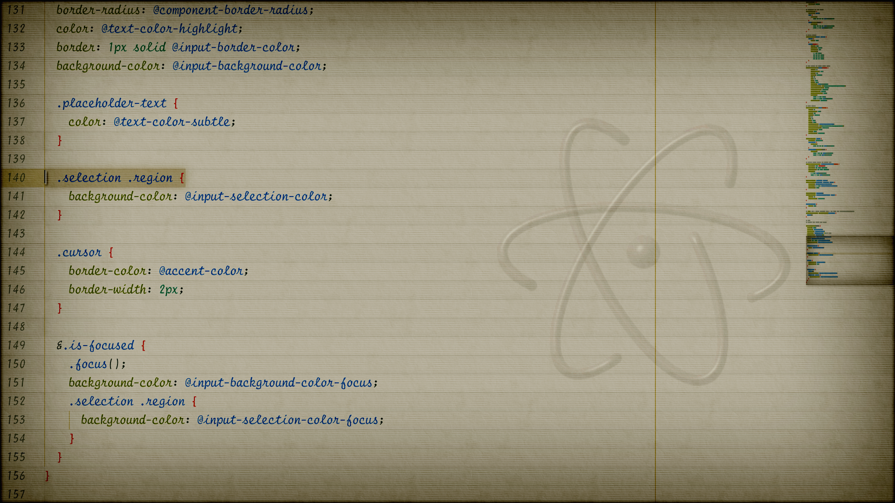

# Notebook UI Theme for Atom

Atom wants to look like an old notebook. Let it.

Notebook UI styles most core elements to make Atom feel right at home in the early centuries. Or in a videogame based in early centuries. Either way, it's what Atom wants.

## Built on Atom One and Fira Code

Notebook UI is based entirely on [Atom One Light UI](https://github.com/atom/one-light-ui) which excels at blending UI styles with syntax theme colors unlike [other themes](https://atom.io/themes/blueprint-ui). Notebook UI's styles don't mesh with as many themes as Atom One but it looks great with probably all light or solarized syntax themes.

It also relies on [Fira Code iScript](https://github.com/kencrocken/FiraCodeiScript) for handwritten font styling.

KNOWN BUGS
* No START or PLAY button.
* Makes all text crooked, wat?
* Playing Nethack in a terminal with this theme is impossibly slow.
